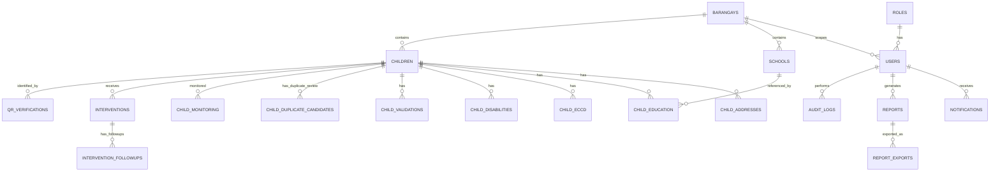

# ERD — Municipal Child Mapping System

## Overview

The database implements a centralized, normalized schema connecting:

```text
Users (with roles and barangay scope)
     │
     ├── Children (core registry)
     │      ├── Child Addresses (history)
     │      ├── Child Education (history, linked to schools)
     │      ├── Child ECCD (history)
     │      ├── Child Disabilities (sensitive, protected)
     │      ├── Child Validations (workflow history)
     │      ├── Child Duplicate Candidates (human review)
     │      ├── Child Monitoring (intervention tracking)
     │      └── Interventions (followed by follow-ups)
     │
     ├── QR Verifications (secure token-based identification)
     ├── Reports (generated by users)
     ├── Report Exports (metadata for generated files)
     ├── Notifications (user-specific alerts)
     ├── Audit Logs (append-only mutation tracking)
     └── System Settings (configuration, no secrets)
```

Reference entities:

```text
Municipalities → Barangays → Schools
```

## Mermaid ERD



## Cardinality

- `ROLES` 1 → N `USERS`
- `BARANGAYS` 1 → N `USERS` (scope)
- `BARANGAYS` 1 → N `SCHOOLS`
- `BARANGAYS` 1 → N `CHILDREN`
- `SCHOOLS` 1 → N `CHILD_EDUCATION`
- `CHILDREN` 1 → N `CHILD_ADDRESSES`
- `CHILDREN` 1 → N `CHILD_EDUCATION`
- `CHILDREN` 1 → N `CHILD_ECCD`
- `CHILDREN` 1 → N `CHILD_DISABILITIES`
- `CHILDREN` 1 → N `CHILD_VALIDATIONS`
- `CHILDREN` 1 → N `CHILD_DUPLICATE_CANDIDATES` (self-referencing through `possible_child_id`)
- `CHILDREN` 1 → N `CHILD_MONITORING`
- `CHILDREN` 1 → N `INTERVENTIONS`
- `INTERVENTIONS` 1 → N `INTERVENTION_FOLLOWUPS`
- `CHILDREN` 1 → N `QR_VERIFICATIONS`
- `USERS` 1 → N `NOTIFICATIONS`
- `USERS` 1 → N `REPORTS`
- `REPORTS` 1 → N `REPORT_EXPORTS`
- `USERS` 1 → N `AUDIT_LOGS`
- `ROLES` N ↔ N `PERMISSIONS` (via `ROLE_PERMISSIONS`)

Note: `SCHOOLS` are reference entities only. There is NO `School User` role.
